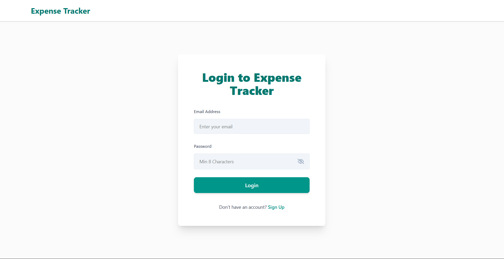
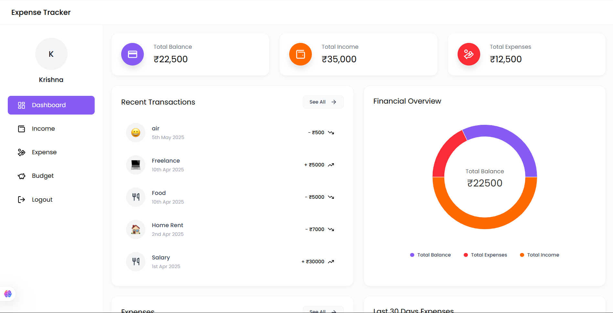

# Expense Tracker

[](https://personaexpensetracker.netlify.app)

🚀 **Deployed App:** [https://personaexpensetracker.netlify.app](https://personaexpensetracker.netlify.app)

A simple Expense Tracker web app built with the MERN stack (React, Node.js, Express, MongoDB) to record, categorize, and visualize personal expenses.

---

## Features

* Add / edit / delete expenses
* Categorize expenses (e.g., Food, Transport, Bills)
* View list of transactions and total balance
* Responsive UI (mobile + desktop)

---

## Tech Stack

* **Frontend:** React (hosted on Netlify)
* **Backend:** Node.js, Express (hosted on Render)
* **Database:** MongoDB Atlas

---

## Screenshots





---

## Local Setup (Optional)

If you want to run the project locally:

1. Clone the repo:

```bash
git clone https://github.com/MukeshCheekatla/Expense-Tracker.git
cd Expense-Tracker
```

2. Install dependencies:

```bash
cd client && npm install
cd ../server && npm install
```

3. Create a `.env` file inside the `server/` folder with:

```
MONGO_URI=your_mongodb_connection_string
PORT=5000
```

4. Run the app locally:

```bash
# start backend
cd server && npm start

# start frontend (in another terminal)
cd client && npm start
```

5. Open **[http://localhost:3000](http://localhost:3000)** in your browser.

---

## Usage

* Add a transaction with amount, category, date and description
* View your balance and expense summary
* Filter transactions as needed

---

## Contributing

Contributions are welcome!

1. Fork the repo
2. Create a new branch (`git checkout -b feature-name`)
3. Commit changes (`git commit -m "Add feature"`)
4. Push (`git push origin feature-name`)
5. Open a Pull Request

---

## License

This project is available under the MIT License.

---

## Contact

**Mukesh Cheekatla** — [cheekatlamukesh@gmail.com](mailto:cheekatlamukesh@gmail.com)
GitHub: [MukeshCheekatla](https://github.com/MukeshCheekatla/Expense-Tracker)
